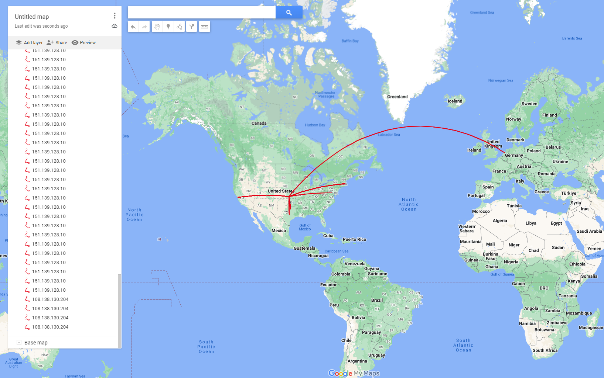

# Network-tracking

## About

 This is a small project that uses a external program called WireShark to detect networking 
 traffic on anyone's device. this device will tell you the connections from Ip to ip 
 connections.  

 ###Downloads

    https://www.wireshark.org  

    geoLiteCity("https://github.com/mbcc2006/GeoLiteCity-data")  

###

